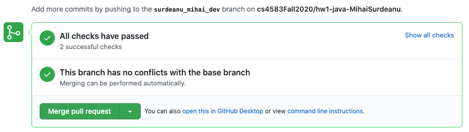
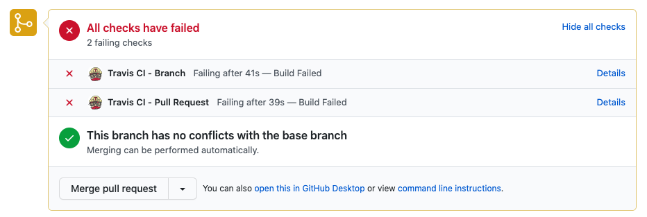

# Setup your environment

You will need to set up an appropriate coding environment on whatever computer
you expect to use for this assignment.
Minimally, you will need:
 
* [git](https://git-scm.com/downloads/)
* [Python (3.8 or higher)](https://www.python.org/)
* [Pytest](https://docs.pytest.org/en/stable/)


# Check out a new branch

Before you start editing any code, you will need to create a new branch in your
GitHub repository to hold your work.

- You will be given a link generated by GitHub Classroom. Click on the link and follow the instructions there. Github classroom should create a corresponding repository for you (either Python or Java.)
- Go to the repository that GitHub Classroom created for you. It should look like
`https://github.com/cs4583fall2020/python-hw*-<your-username>`, where
`<your-username>` is your GitHub username. 
- Create a [branch](https://help.github.com/articles/creating-and-deleting-branches-within-your-repository/) through the GitHub interface.
- Name your `<branch>` as `yourlastname_yourfirstname_dev` (**very important , do NOT name it anything else**)
- Clone the repository to your local machine and checkout the branch you
just created. Your command must be similar to :
   ```
   git clone -b <branch> https://github.com/cs4583fall2020/python-hw*-<your-username>.git
   ```

# Write your code

You will implement one function each for each of the sub questions, Eg:` def runQ4_3_with_smoothing` inside 
the class `QueryEngine*`(src/main/python/edu/arizona/cs/queryengine*.py). These functions should return the documents in the right order , as asked in the question. 

Also, you **should not edit** these files:
- `.travis.yml`
- `src/main/resources/*.txt`
- `src/test/python/edu/arizona/cs/*.py`


# Test your code

Tests have been provided for you in the `src/test/python/edu/arizona/cs/test_*.py` file.
To run all the provided tests, just type/run  ``pytest`` from command line from the directory containing `src/` or any of its subdirectories

If your code passes the test case, you will see output like:
```
============================= test session starts ==============================
platform darwin -- Python 3.8.3, pytest-5.4.3, py-1.9.0, pluggy-0.13.1
rootdir: /Users/mordor/tawork/hw1/hw1_python
collected 3 items                                                              

src/test/python/edu/arizona/cs/test_q5.py ...                            [100%]

============================== 3 passed in 0.10s ===============================
```

# Submitting your code

As you are working on the code, you should regularly `git commit` to save your
current changes locally and `git push` to push all saved changes to the remote
repository on GitHub.    

To submit your assignment,
[create a pull request on GitHub](https://help.github.com/articles/creating-a-pull-request/#creating-the-pull-request).
where the "base" branch is "master", and the "compare" branch is the branch you
created at the beginning of this assignment.
Then go to the "Files changed" tab, and make sure that all your changes look as you would expect them
to.
There are test cases that will be run automatically (via., [travis](https://travis-ci.com/))
when a pull request is submitted. 
These are the same as `pytest`. 
So if your code passed `pytest` in your machine, 
it’s highly likely that it will pass in github. Nevertheless 
you should make sure that you see a green tick mark or a message 
saying “All Checks Have Passed”. 



If your test cases are failing, you will get an error message like this.

Click on the link which says `details` and find out what is causing the issue or which test case is not passing. Once you have identified that, close the pull request, fix the errors, and raise another pull request.
**Do not merge the pull request.**

Your instructor will grade the code off this pull request. 
Pull requests submitted after the deadline won’t be considered.
 
# Grading

Programming question of this assignment will be graded primarily on their ability to pass the tests that
have been provided to you on github after the pull request.
Assignments that pass all, and with the corresponding code implementing the correct logic, will receive at least 95% of the
possible points.

To get the remaining of the points, your code will be checked for things like readability and code quality.

Note: there will be a penalty for not following all instructions.

